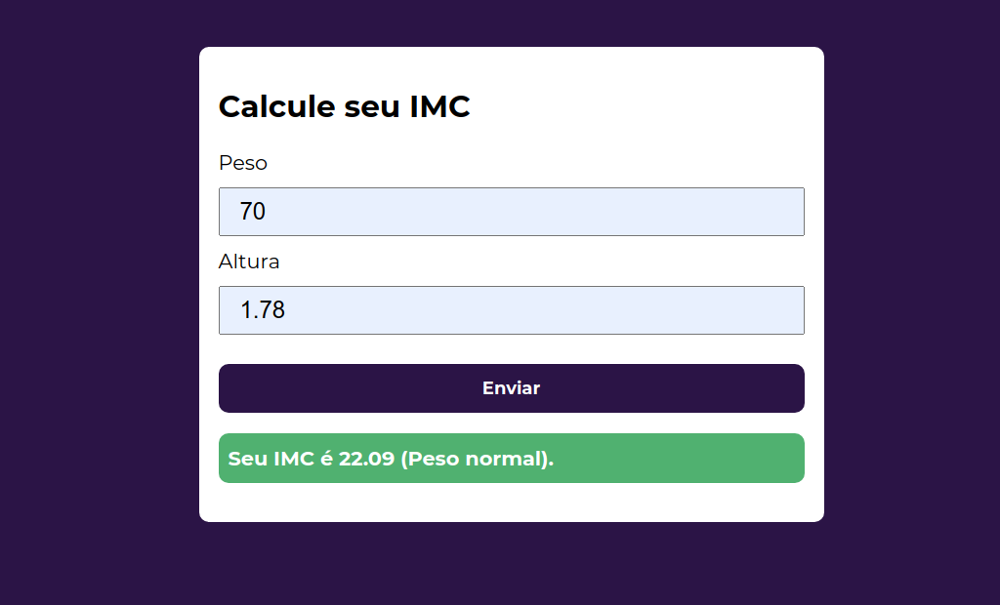
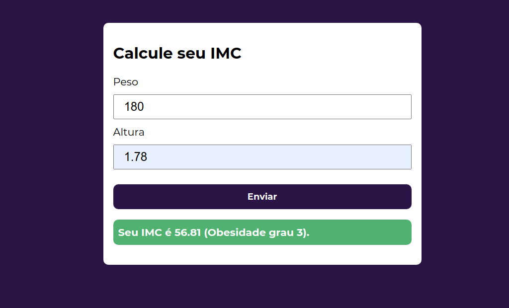
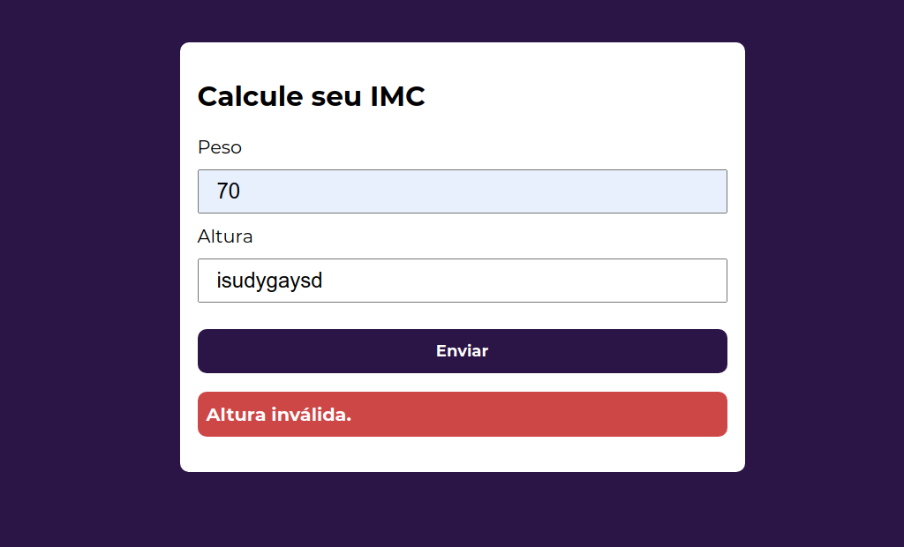
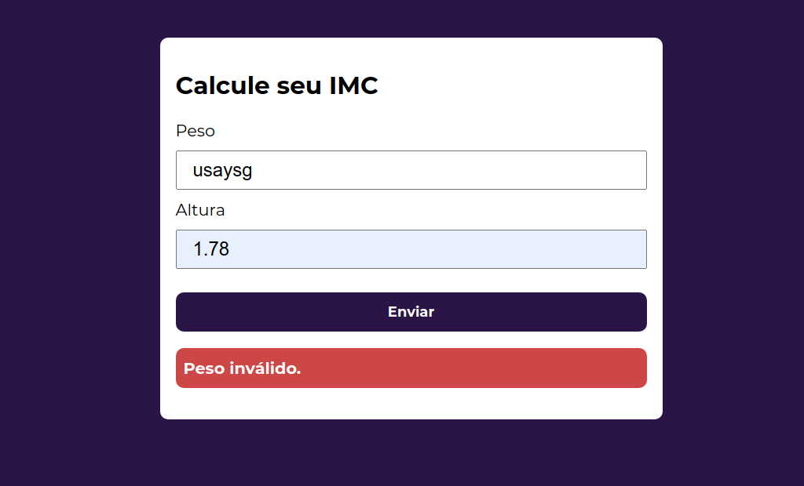

# Calcule seu IMC
🔢 Projeto simples de uma calculadora de IMC utilizando HTML, CSS e JavaScript.

  
  

  
  

#### O que fiz?
- Validação de Input
- Exibição de Erros
- Manipulação da DOM

Eu disse que era simples 🤷🏽
